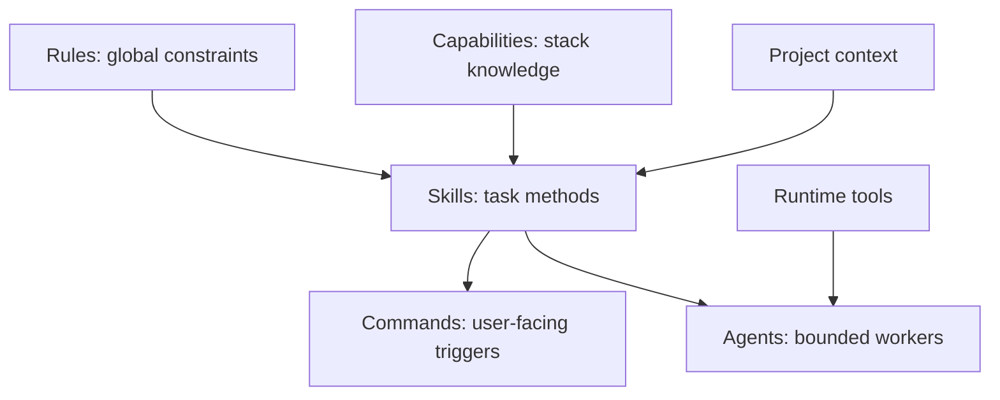

# AI-assisted development skill library

This is a cross-stack, reusable library for AI-assisted developers. It is a workflow system, not a fixed project template. It separates reusable constraints, task methods, commands, worker roles, runtime tools, and project-specific context.

## Skills

| Skill | Responsibility |
| --- | --- |
| [loop-delivery](skills/loop-delivery/SKILL.md) | Iterative idea-to-deploy-ready lifecycle |
| [loop-interface-audit](skills/loop-interface-audit/SKILL.md) | Autonomous UI/UX audit, fix, and verification loop |
| [loop-code-audit](skills/loop-code-audit/SKILL.md) | Autonomous code audit, repair, and verification loop |
| [machine-init](skills/machine-init/SKILL.md) | Global Codex/Claude scratch environment |
| [project-init](skills/project-init/SKILL.md) | Specific project initialization |
| [delivery-plan](skills/delivery-plan/SKILL.md) | Goal-driven delivery planning |
| [arch-design](skills/arch-design/SKILL.md) | Architecture decisions |
| [code-implement](skills/code-implement/SKILL.md) | Scoped implementation |
| [bug-investigate](skills/bug-investigate/SKILL.md) | Evidence-based debugging and repair |
| [behavior-verify](skills/behavior-verify/SKILL.md) | Behavior verification |
| [change-review](skills/change-review/SKILL.md) | Evidence-backed code review |
| [ui-audit](skills/ui-audit/SKILL.md) | Visual interface audit |
| [flow-design](skills/flow-design/SKILL.md) | User-flow and usability decisions |
| [support-resolve](skills/support-resolve/SKILL.md) | Client support triage with split client/internal answer |

`loop-delivery` is the only lifecycle loop. Its cycle is inspect, decide, delegate or act, verify, evaluate, then repeat until the requested finish line is met. It coordinates product framing and deploy-ready handover as internal methods. Actual deployment remains excluded.

## Supporting layers

- [Rules](rules/README.md) contain global constraints such as coding correctness, simplicity, engineering principles, and output and context economy.
- [Capabilities](capabilities/README.md) contain technology-specific knowledge. They are selected from the repository's actual stack and never define a universal workflow. Currently Laravel + Livewire, Next.js, and databases (PostgreSQL, MySQL, MongoDB).
- [Commands](commands/README.md) map `$skill-name` triggers to task skills.
- [Agent roles](agents/README.md) define bounded workers. A skill is a method; an agent is a worker assigned to use one.
- [Tools](tools/README.md) are inspected at runtime rather than presumed in the library.
- A project's own instructions and observed code override these global defaults wherever they conflict.

## Defaults and boundaries

For a new business portfolio without an established stack, Laravel with Blade and Livewire is the starting recommendation. Existing stack and project instructions win. Next.js is considered when the actual workload and frontend needs justify it.

Use `$loop-interface-audit` when an interface needs a complete autonomous audit-and-fix cycle with bounded sub-agents. Use `$ui-audit` for a visual-only audit and `$flow-design` for a journey-only analysis. They are intentionally separate.

Use `$loop-code-audit` for a complete engineering audit-and-fix cycle. Use the individual architecture, implementation, debugging, verification, and review skills for a narrow outcome.

Use `$support-resolve` when the input is a customer's report rather than an internal task; it classifies confusion, bug, or enhancement, routes the technical work to the task skills, and answers in a client part plus an internal part.

Use `$code-implement` for a clear scoped change, `$bug-investigate` for a supported failure, `$behavior-verify` for verification, and `$change-review` for assessment. Use `$arch-design` only when the boundary or structure is material.

The source library is this workspace. Codex reads copies under `~/.codex/skills/` and Claude Code reads symlinks under `~/.claude/skills/`; `tools/install.sh` refreshes both. Synchronize the owned bundle after edits because task skills link to shared rules and capabilities. No application, deployment, or production operation is implied by this library.
