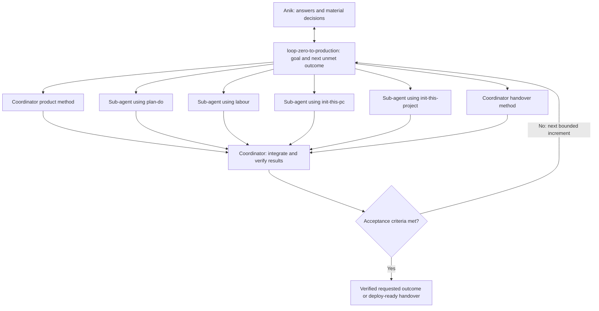

# Loop Zero to Production — Anik's connected skill library

`loop-zero-to-production` owns a goal-driven loop from an idea or client brief to a verified project ready to deploy. It defines the requested outcome and acceptance criteria, selects the next unmet outcome, delegates bounded work to sub-agents using the connected micro-skills, integrates their results, verifies behavior, and reassesses what remains. It continues until the requested outcome is complete or a necessary answer blocks the remaining work.

Ask material questions immediately when a missing requirement, uncertainty, or decision is discovered. The coordinator brings questions from sub-agents to you, explains the consequence, reuses your answers and authorization, and continues independent work while waiting. Shared decisions, artifacts, open questions, and verification evidence prevent each worker from restarting discovery.

Actual deployment, infrastructure provisioning, production migrations, and rollout operations are excluded. The loop and its sub-agents run within the active task; the skill does not create scheduled background jobs.

## Connected micro-skills

| Skill | Purpose | Useful result |
| --- | --- | --- |
| [loop-zero-to-production](skills/loop-zero-to-production/SKILL.md) | Own the goal, interaction, delegation, and verification loop | Integrated work with evidence that the overall finish line is met |
| [plan-do](skills/plan-do/SKILL.md) | Goal-driven delivery planning | Observable acceptance criteria, ordered increments, dependencies |
| [labour](skills/labour/SKILL.md) | Architecture, coding, debugging, and review | Decisions, verified behavior or focused fixes, and evidence-backed findings |
| [init-this-pc](skills/init-this-pc/SKILL.md) | Prepare a Codex or Claude scratch environment | Local tooling discovery, safe global/scratch setup, environment verification |
| [init-this-project](skills/init-this-project/SKILL.md) | Initialize a blank or instruction-only project | Native project setup, project instructions, local verification |

The diagram shows available delegation paths; it does not require every worker or stage to run at once. Micro-skills are reusable instructions. Sub-agents are actual workers spawned with a concrete task, relevant skill, acceptance criteria, context, and file ownership. Parallelize independent work when it can run alongside useful coordinator work. Serialize dependencies and overlapping writes, then integrate and check the combined result. The coordinator remains accountable for the goal and evidence; a worker's completion is an input to that check.

Start at the next unmet outcome, use existing work, and skip irrelevant stages. A planning-only request finishes at its plan; a directly invoked Labour request finishes at its scoped verified outcome. Its delegation stays within that narrow request. For full delivery, a plan, scaffold, or code edit is an intermediate result.

The [shared handoff contract](skills/loop-zero-to-production/references/handoff.md) defines what flows between skills and workers. Resolve companion paths relative to the loaded skill folder. Read the selected micro-skill's entry point, then only its applicable resources. The [operating loop](skills/loop-zero-to-production/references/operating-loop.md) handles checkpoints, immediate questions, failures, and completion. The [delegation guide](skills/loop-zero-to-production/references/delegation.md) defines worker assignments, coordination, and integration. This structure is intended to shorten development through independent parallel work; no speed improvement has been measured.

## Engineering defaults

A new business portfolio defaults to **Laravel + Blade + Livewire**. Use Laravel's official Boost guidance and applicable package skills when setting up a real Laravel project. Use **Next.js** when demonstrated scalability and frontend needs justify that choice; identify the actual workload and trade-off. Existing stacks and explicit choices remain controlling. Official guidance is applied to the installed framework version rather than freezing library-wide package versions.

[labour](skills/labour/SKILL.md) owns architecture, coding, debugging, refactoring, and code review. Its [strict development rules](skills/labour/references/coding-rules.md) cover scoped changes, useful types, server validation and authorization, safe data handling, precise money behavior, deliberate errors, usable interfaces, meaningful checks, and no disabled gates to manufacture success. Labour combines Ponytail-derived simplicity with [community Karpathy-inspired guidance](skills/labour/references/engineering-principles.md); it is not an official Andrej Karpathy skill. The approach defaults to the smallest clear solution that preserves requirements, security, money invariants, accessibility, and useful verification.

The requested Ponytail clone remains at `lazyagent/`, from [Dietrich Gebert's upstream repository](https://github.com/DietrichGebert/ponytail), commit `e3ba2aa6f1e6f0bc4d69eb09c9f0d0a93af56156`. Labour is the adapted runnable skill and preserves its MIT notice. The upstream clone and existing installed Ponytail plugin retain their original integrations and branding.

## Your methods and what remains open

Your first focus is **idea to MVP: product decisions, scope, planning, and delivery**. Confirmed discovery framing considers the core user journey, technical or nontechnical roles, product type, and business domain. The coordinator's [product examples](skills/loop-zero-to-production/references/product-examples.md) capture three different starting points:

- Taveco Air: reference-inspired structure adapted to the client's brand, marketing vibe, packages, content, and flows.
- Mollah Auto: a solution chosen from client-described problems.
- Home service: a client-requested similarity level, with changed colors, accents, and vibe. The 80% figure belongs to that project.

This library is a working method, not a claim that your complete thinking has been recovered. Detailed prioritization, estimation, personal naming conventions, acceptance criteria, and domain-specific rules still require examples. The [profile](skills/loop-zero-to-production/references/profile.md) distinguishes confirmed preferences from open questions. Proposed methods are starting policies you can refine.

The additional context and standards files referenced by your global `AGENTS.md` were not found during setup. Their contents are not invented. Project-specific instructions and actual code remain the source for established conventions.

To capture another method, use [personalization](skills/loop-zero-to-production/references/personalize.md): record a real decision, alternatives, constraints, result, context, and exceptions. Bengali or English is fine for discovery; code and documentation default to English.

## Using the library

For full delivery in a blank folder: “Use `$loop-zero-to-production` to turn this client brief into a verified MVP ready to deploy. Run the goal-driven loop with sub-agents, and ask material questions as soon as they arise.” The loop uses `init-this-project` for the application; it uses `init-this-pc` only for explicitly requested Codex/Claude scratch setup or a verified PC-level blocker.

For scoped coding:  “Use `$labour` to implement this agreed increment with the project's conventions and relevant checks.” The other micro-skills can also be invoked directly for their own purposes.

The `loop-` prefix makes the coordinator's execution model explicit: invoke `$loop-zero-to-production`. It replaces the former installed name `zero-to-production`; keep one coordinator, without a duplicate under the old name.

The editable source is this workspace's `skills/` directory. Matching sibling copies are installed under `~/.codex/skills/<skill-name>/`. Install and synchronize the complete bundle, because micro-skills refer to companions. If a new skill is absent from the session's discovery list, start a new session before relying on automatic selection.

After edits, validate each changed skill, check the whole local link graph and UI metadata, then synchronize only owned installed folders. The [evaluation cases](skills/loop-zero-to-production/references/evaluation.md) distinguish structural checks, author walkthroughs, and independent behavioral execution. No application has been built or deployed merely by creating this library.

## Future additions

Add further micro-skills when a real repeated purpose needs its own trigger and useful standalone workflow. Domain and stack guidance belongs where it changes decisions; reuse available specialists rather than duplicating their manuals. Examples could establish your UX review method, API contracts, payment reconciliation, mobile constraints, analytics, AI evaluation, or maintenance priorities. Deployment remains outside this bundle unless you explicitly redefine its scope.
