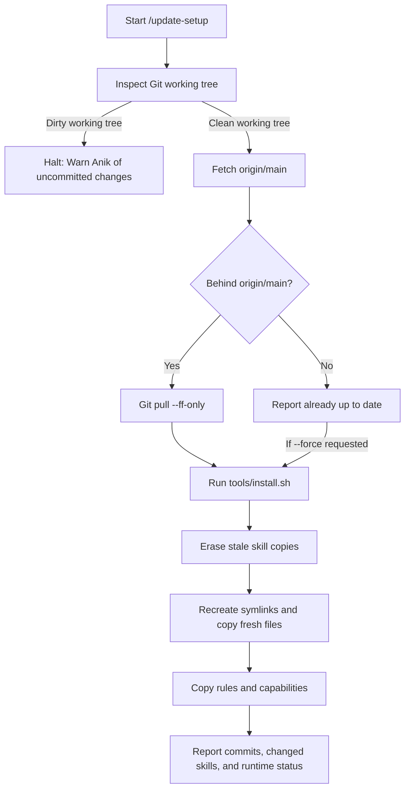

# Update Flow Reference

Detailed process for checking, pulling, and synchronizing Anik's full-stack coding setup.

## Workflow steps

## Handling edge cases

### 1. Uncommitted local modifications
If local files in `ai-coding-tool-helper` are modified or staged:
- Do not run `git pull` blindly.
- Check `git status -s` and ask or report the exact modified files.
- Options: Anik can commit the changes, stash them (`git stash`), or discard unneeded local edits.

### 2. Diverged history (Ahead and Behind)
If the local branch has local commits AND upstream has new commits:
- Fast-forward pull will fail cleanly.
- Inform Anik of the diverged commits (`git log --oneline HEAD..origin/main` vs `origin/main..HEAD`).
- Do not perform an automatic forced overwrite without confirmation.

### 3. Orphaned or renamed skills
When a skill is renamed or removed in the repository:
- `tools/install.sh` identifies all directories in target locations with `.from-full-stack-coding-setup`.
- Any installed directory whose source folder no longer exists under `skills/` is purged with `rm -rf`.
- Unrelated skills lacking the marker are never touched.

### 4. Offline or remote fetch failure
If `git fetch origin` fails due to network issues or SSH authentication:
- Report the connection error clearly.
- If a refresh of local runtimes is still desired, run `./tools/update.sh --force` or `./tools/install.sh` using the existing local repository files.
